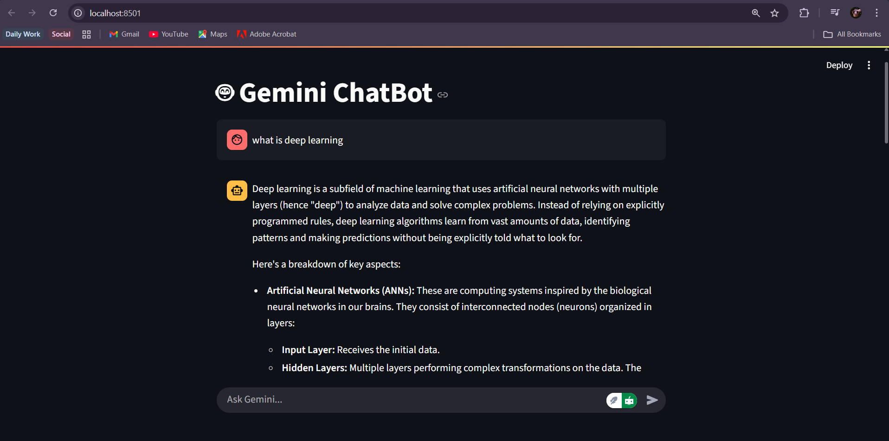
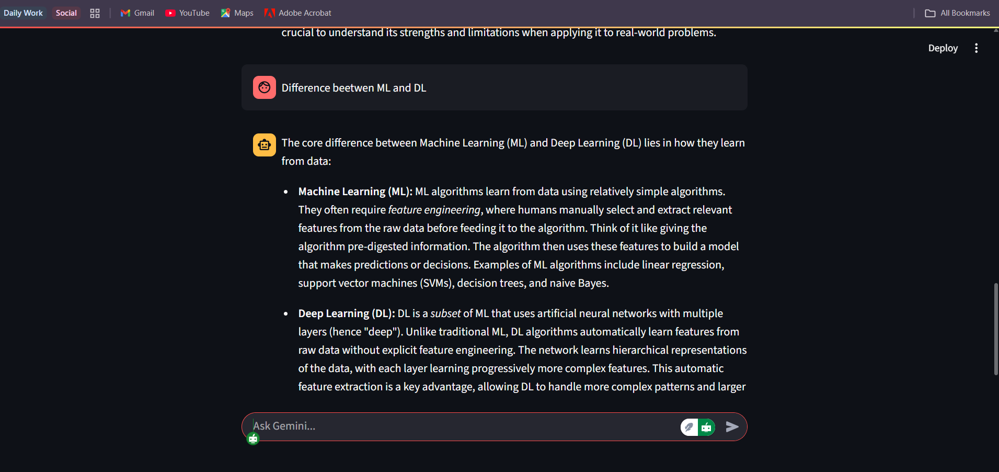
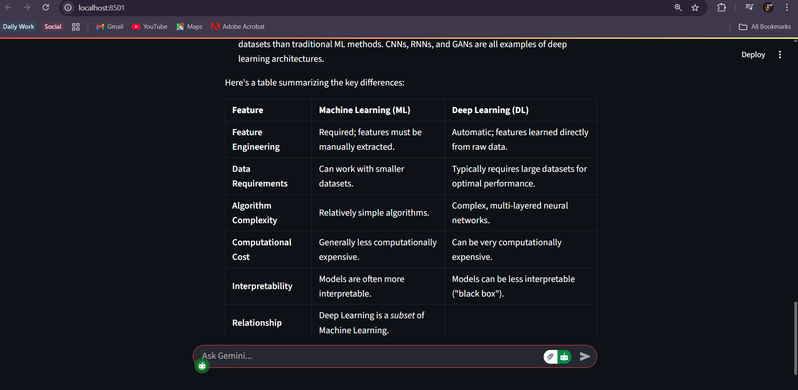

# 🤖 LLM-Chatbot

A **Streamlit-based AI chatbot** powered by **Google Gemini API**.  
By default, it runs on `gemini-1.5-pro` and automatically falls back to `gemini-1.5-flash` when free-tier quota is exceeded — ensuring uninterrupted conversations.

---

## ✨ Features
- 🚀 Powered by **Google Gemini API** (`gemini-1.5-pro` / `gemini-1.5-flash`)  
- 💬 Interactive chatbot UI built with **Streamlit**  
- 🔄 Automatic **model fallback** when quota limits are hit  
- 📝 Persistent **chat history** in the session  
- 🔑 Secure API key handling with **dotenv**  

---

## ⚙️ Setup & Run

1. **Clone this repository**
   ```bash
   git clone https://github.com/Pallavi1904/LLM-Chatbot.git
   cd LLM-Chatbot
2. **Clone this repository**
   ```bash
   pip install -r requirements.txt
3. **Set up environment variables**
   Create a .env file in the project root and add your Google API key:
   ```bash
   GOOGLE_API_KEY=your_google_api_key_here
4. **Run the chatbot**
   ```bash
   streamlit run main.py

---

## 📸 Screenshots

Here’s how the chatbot looks in action:

  


  


  


---

## 🚀 Future Enhancements
- 🎛️ Sidebar dropdown to select models (`pro` / `flash`) manually  
- 📊 Token usage and quota tracker  
- 🌙 Dark/Light mode toggle  


   

